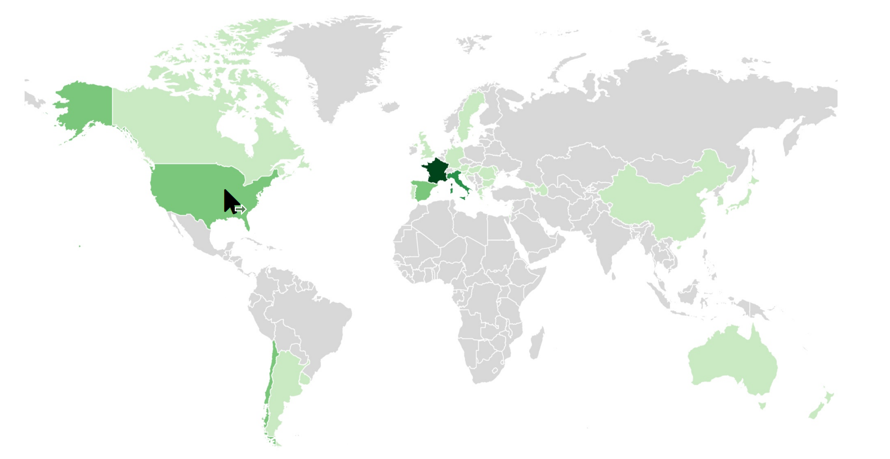
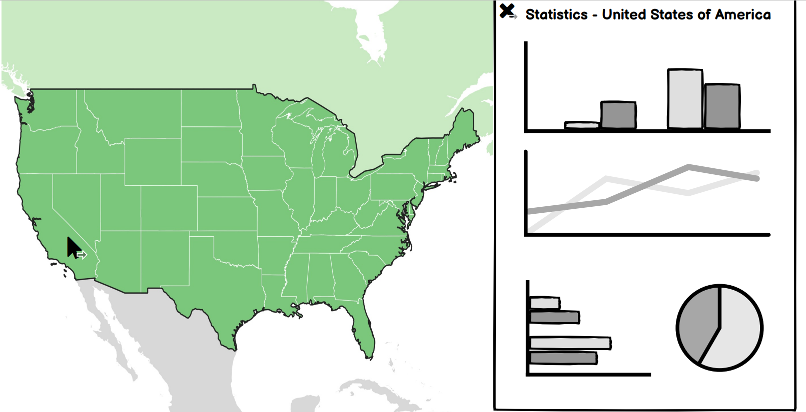
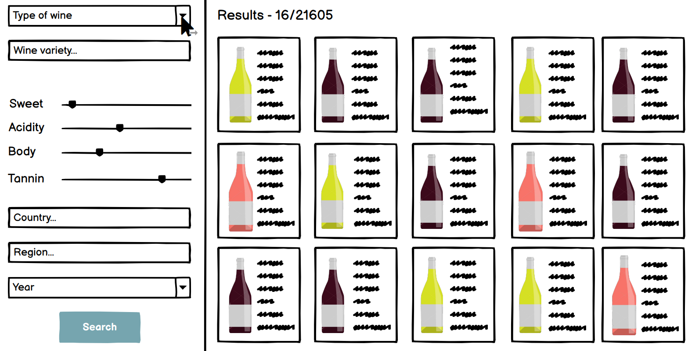

# Milestone 2
We have two main ideas that we would like to implement for our wine dataset. The first idea focuses on visualizing the dataset on a world map, looking at the origin of each wine present in the dataset. For the second part, we would like to create an interface to filter the dataset and choose a wine depending on its characteristics.

## Website structure
We would like to have a nice introduction page, showing some images and giving a few definitions about some terms linked to the wine domain. We would like to also give a few informations about the production line of the wine. The reader will be able to learn a few things before diving into the rest of the website.\
**Related lectures:** Designing vis, Text\
**Tools:** Boostrap (design)

## World map visualization
We aim at creating a nice and interactive way to visualize our dataset on a map. On the initial world map, every country is represented in a color depending on the number of wine they produce and that are present in our dataset. The user is then able to click on a continent to zoom in. Clicking a second time makes it possible to zoom in on a country. 

At every step, we would like to show some statistics about the chosen location. Once the user picks a country, the location of every wine produced in that country is represented.

**Related lectures:** Maps, Tabular Data, Graph\
**Tools:** D3.js (world map, zoom function etc.) + pandas to prepare the data

## Filter
Some people like acidic wines, some don’t. Some people like wine with tannin, and again, some don’t. What do you like? Both?

The filter we would like to implement enables you to find your very own wine. The user is able to select every characteristic he wants. Whether the user is on a budget and doesn’t want an expensive bottle, or if he is looking for a specific taste, or if he wants to drink a wine coming from Argentina, etc. Once you’ve chosen how the wine has to be, you can have a look at the list of every wine corresponding to your description.

**Related lectures:** Designing viz\
**Tools:** Javascript 

## Extra ideas
Something we haven’t decided yet is at which extent the user is able to zoom in on the map. Do we stop at the country scale, or is it possible to zoom in on a region, a canton for example.
An extra idea that we had is a way to get from the map to the filter and vice versa. For instance, the user is visualizing the places swiss wines are produced at and decides that he would like to look for a swiss wine. By clicking on a button, he is redirected to the filer with “Switzerland” already being selected and showing the results. He can also add some specific characteristics. The opposite would also be possible: selecting characteristics in the filter, clicking on a button and being redirected to the map showing the locations of the corresponding wines.

## Links
Here is the link to our website prototype: [Prototype](https://com-480-data-visualization.github.io/datavis-project-2022-hmc/index.html) \
This is the architecture we would like to have: [Architecture](../docs/Data_viz_maquette.pdf) (the pdf prototype is not clickable on github, so should be downloaded)
