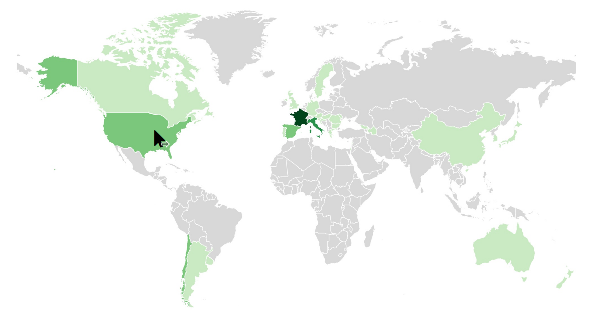
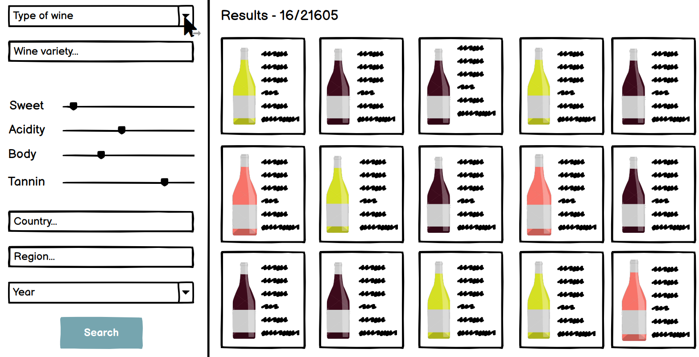

## Milestone 3

We had two main ideas for this project about wine exploration, explained in the previous milestones. The first was to visualize the dataset on a world map, looking at the origin of each wine present in the dataset. And for the second part, we wanted to create an interface to filter the dataset and choose a wine depending on its characteristics. Finally, we also decided to give some information about wine and some definitions in the first page.

### Describe the path you took to obtain the final result

First, we identified the main tasks of the project and tried to split the work required to obtain the minimum viable product (MVP) of what we wanted to achieve. Also, we tried to anticipate the changes needed to improve the MVP, when it will be ready. First tasks were basically a static version of the about page, pre-processing of the regions, visualization of regions with a zoom on the world map and a first version of the filter with few variables implemented. A first version of the world map with interactive tooltip was already working from our prototype, but all the other functions had to be done.

Once these tasks were finished, we added few D3 visualizations in the about page, to add interactivity and improve the user experience. Indeed, we wanted to not only visualize the data, but also create a datastory. We wished that the first page would give basic information about the dataset to the user, so he could (and would want to) explore on his own the search and filter pages. In addition, we added a bar plot in the map page, with the possibility for the user to select the variable to show. When the user click on a country, the map zoom on it and the right-side bar plot is updated. If the country contains enough data, the zoom reveals the different regions, and the user can select them to show statistics based on the regions. Finally, we increased the number of variables to use in the filter, and added an auto-complete feature. The auto-complete takes account the previous choice already filled, to reduce the possibilities to display to the user.

### Explain challenges that you faced and design decisions that you took

The first challenge we faced was the preprocessing of the dataset. We chose a dataset that was normally cleaned and required few preprocessing for the different variables. However, we still needed to match geographical regions (that we can plot on the map) with locations of each wine bottle included in the dataset. For the countries this task was pretty easy (as the names of the countries are almost standard, even if USA or United States of America could differ). For the regions, this task was harder, as the locations included in the dataset were not standard regions for all countries. For example, the locations of Chile, in the dataset, correspond to the Valleys were the wine is produced, and not to the administrative regions. We chose to provide regional information, and therefore we had to convert locations in the dataset, to match administrative regions of the countries. 

We decided to show regions in the map for the following countries: France, Italy, USA, Chile and Spain. We took the top 5 countries present in the dataset, because as you might understood, showing different regions require a significative amount of work. In addition, it does not make a lot of sense to show aggregate data (barplots about different variables) if regions only contains few wine bottles.

At first, to be able to display the regions of the countries mentioned above, we tried to display the polygons of the regions (ex: France.json) on top of the polygons of the countries (world.json). But this did not work as we expected, so in order to solve this problem we used a topojson file. The TopoJSON format is lighter than the GeoJSON format, avoids redundancy and allows to store several spatial layers. So, in the location page, we first display the world map. We then display the regions when you click on a country, we added a part in the "clicked" function that displays the polygons of the corresponding country.

Once we managed to display the regions of some countries by clicking on them, we realized that the polygons of the administrative divisions of these countries were much more detailed than the world map in the background. This caused 2 problems, firstly, the very detailed borders of the regions contrasted with the very simplified borders of the countries. Second, the loading time of these files was much longer. So, to solve this problem, we processed these shapefiles on QGIS software. We used the intersection, drawing and simplify geometry tools to simplify the boundaries and to match the world map with the regions map.

In addition, a remaining challenge for the map was the selection of the proper variables to show in the bar plot. Indeed, we want to be able to select the variable with the dropdown button, keeping the selected region or country as a filter for the data. Also, we want to keep the same variable to show when we go from a country to another (or from a region to another) to be able to compare them. We could achieve this with a function that update the barplot with 3 inputs: selectedVar, level (world, nation, region) and value of the level ('France' for e.g.). If the selectedVar is 'undefinded' then we keep the previous one (or default one year), and similarly if level is not world, nation, nor region, then we keep the previous values.

Finally, for the filter, we had previously chosen a slider to choose different level of sweetness, acidity etc. This wasn't ideal because the user would only be able to choose a single value for each attribute(for example, only sweetness level 4 and not the others). We thought about filtering all the wines that have the same or a smaller attribute than what the user puts on the slider, but we decided to change the way of choosing an attribute for clarity. We understood that the user would probably want to choose multiple values for a single variable. For example, the user might want to see all wines with acidity levels of 1 and 2 (and not only to 1). Therefore, we decided to remove the slider, and use a checkbox. Indeed, it will allow the user to select multiple values for a same variable, and makes the use of the wine search more comprehensible.

To implement autocomplete in the different search bars, we had to make choices. Indeed, we hesitated between implementing an autosuggestion based on the whole dataset or only on the part already filtered. For the first proposal, it means that if you select "Type=Red" and then want to choose a grape variety, the autosuggestion may propose "Chardonnay" which is not very coherent. For the second proposal, it means that if you select "country=Germany", and then want to chose a producer, the search bar "Producer" will only propose producers from Germany. However, you need to press enter or the button apply between the 2 action in order to reduce the suggestion.
We decided to implement the second proposal.

### Reuse the sketches/plans that you made for the first milestone, expanding them and explaining the changes

#### The about page:

Sketch of the about page:

### Actual about page (a part of it): 

The main changes in this page correspond to the different interactive plots added and also the definitions of the key concepts for wine.

### The map page:

### Sketches for the map page:

The implemented website looks very similar to what we planned in the sketches, we simply decided to use one plot on the sidebar as it was already large and sufficient to have a sense of the different aggregated data.

### The filter page:

### Peer assessment:
We all contributed to the different ideas \& general decisions about the website. In addition, we all contributed equally to the report and the creation of the video. For specific task split:
- Hendrik: implement filter (page search.html)
- Marie: add zoom function + region functionalities + preprocessing of the map in Qgis (page location.html) + auto-complete in filter
- Clément: about page (index.html) + preprocessing in the dataset of the region from location + bar plot (location html)

### Links
Here is the link to our website : [Wine exploration website](https://com-480-data-visualization.github.io/datavis-project-2022-hmc/) \
Here is the link to our screencast video : [Screencast video presentation](https://drive.google.com/drive/folders/1jcNN1umqp4zI_OiV0H8SnzchlDbCSG_W?usp=sharing)
