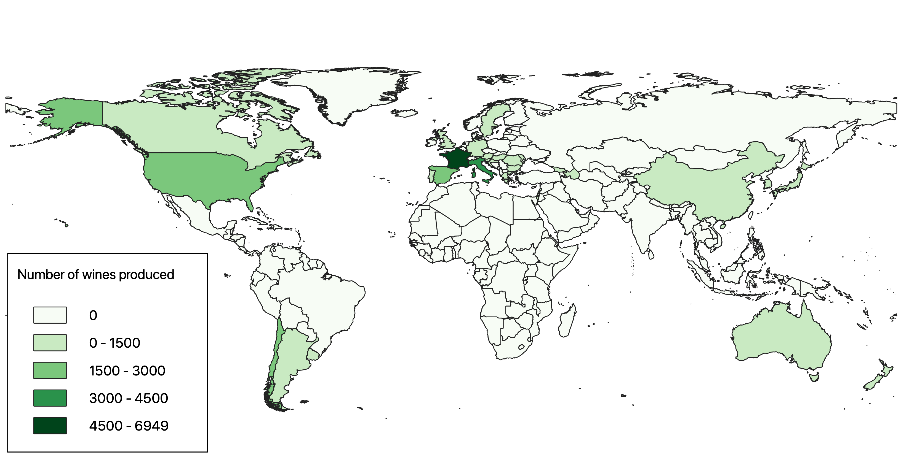
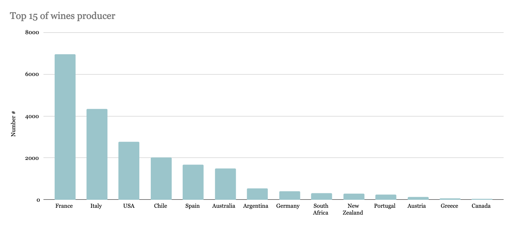
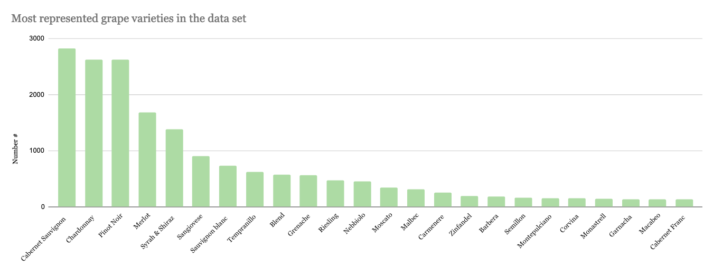

# Project of Data Visualization (COM-480)

| Student's name | SCIPER |
| -------------- | ------ |
| Hendrik Hilsberg | 274984 |
| Marie Gaiffe | 272409 |
| Clément Lhoste |284554 |

## Milestone 1

### Dataset

The dataset we would like to use is called “Wine Information”. The dataset is extracted from Kaggle (https://www.kaggle.com/code/dev7halo/wine-base/data) and contains data about different wines around the world.
The dataset is composed of 21605 different wines, with very detailed information.
Indeed, we have the name of the wine, the producer, geographical information (nation and local regions), wine varieties, type of wine, in what occasion it is normally used, alcohol by volume, drinking temperature, flavors (sweet, acidity, body, tannin), price, year, and volume of the bottle.

The data is already preprocessed by the author and should be ready to use. For example, the author cleaned the nation column, where Riesling was present. However, we observed that some data is still written in Korean, notably in local information. There are also some wine attributes missing, meaning that the information about the wine bottles is not always complete. Finally, the price is in Korean WON, and should be converted to Swiss francs.
We will probably need to clean the geographical information, to ensure its correctness and consitstentness to allow the creation of a map with aggregated data from nations and regions.

### Problematic

We would like to show in an interactive and visually pleasant way the different characteristics of wine bottles around the world. The idea is to create a platform to explore wines and discover new bottles. The target audience would be the general public, interested in discovering new wines, and more specifically wine amateurs, willing to learn more about their passion.
The two main objectives of the visualization are:
- Observe different locations of wine production on a world map, with the interaction of the user to explore different regions and have insights on aggregated data (per region): distribution of wine variety, prices, …
- Possibility to filter different wines by criteria (such as varieties, price, type of use etc.) and then show the list of corresponding bottles. We would like to create “wine cards”: plot with sweet/acidity/body/tannin, and other information like: use, variety, abv, temperature, price, and year. This would help to compare different wines and their characteristics.

### Exploratory Data Analysis
The following figures present the number of wine produced in each country, this gives us information about the spatial distribution of the data. Thus, it appears that the great majority of the big wine producers are European countries, especially France and Italy.  The United States and Chile present nevertheless important production. 

This second histogram show the most represented grape varieties in the data set. Thus, it appears that the "Cabernet Sauvignon", the "Chardonnay" and "the "Pinot Noir" are the most produce varieties around the world according to our data set. For the next steps, we will represent this information at the country and regional level to highlight the likely change in the distribution of the variety produced between countries and regions. 

### Related work

We took some time to look around and search what had already been done with wine datasets. The most common way of representing such a dataset is by giving, for each wine, a review of its characteristics. These characteristics usually contain the following information: the name of the wine, its origin, the production year, the alcohol percentage, the price, some information about the taste, and a rating. Another common way of representing, or analyzing, a wine dataset is to compare the price of the wine to another of its characteristics. The wine ratings are often compared to the price, and occasionally some other characteristics. 

We also found a website that let you enter some wine characteristics (of the taste), such as the acidity, the smokiness, the tannin, etc. Once you select your favorite taste specificities, the result is a list of wines corresponding to all these features. We really liked this principle and are willing to integrate a similar way of filtering the wine database. In addition to a simple list of wines as an output, we would like to go further and pin down each wine on a map to be able to see their origin (at least their region of origin).

References to the work mentioned above:

Interactive Visualization of Washington Wine, with flavor filtering: https://stevejoachim.github.io/wine-data-viz/

Nice interactive wine statistics (price and ratings): https://projectvisualizewine.wordpress.com/

Different data exploration methods using data on wine: https://towardsdatascience.com/un-bottling-the-data-2da3187fb186
